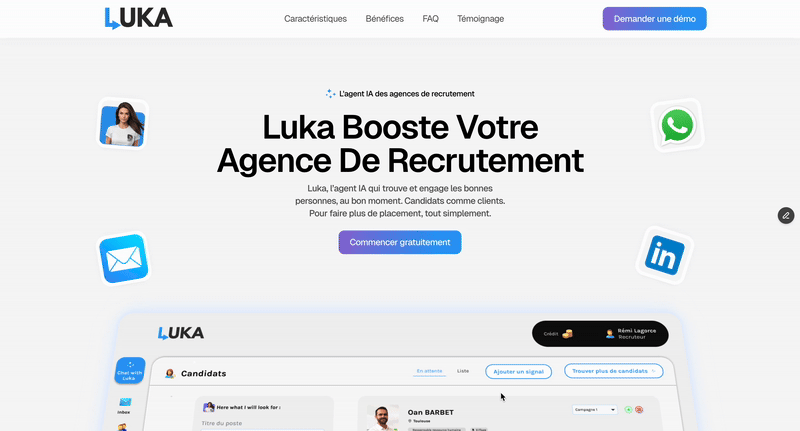

## Hello 👋

🔥 My name is Rémi, fullstack developer from France

❤️‍🔥 Tech and business enthusiast

🧘‍♂️ Stoic, rationalist, and spiritualist. Constantly striving for personal growth, self-mastery.

🏅 Always looking for new challenges.

Main dev skills : 

➡️ Nextjs

➡️ Nodejs

➡️ RestAPI

Currently working on (personal side project) : [visit website](https://www.go-luka.com/)

👀 Find more about me and my projects [here](https://remilagorce.github.io/remilagorce/)

💬 Ask me about anything [here](mailto:remi.lagorce@outlook.fr)

<!--
**remilagorce/remilagorce** is a ✨ _special_ ✨ repository because its `README.md` (this file) appears on your GitHub profile.

Here are some ideas to get you started:

- 🔭 I’m currently working on ...
- 🌱 I’m currently learning ...
- 👯 I’m looking to collaborate on ...
- 🤔 I’m looking for help with ...
- 💬 Ask me about ...
- 📫 How to reach me: ...
- 😄 Pronouns: ...
- ⚡ Fun fact: ...
-->
